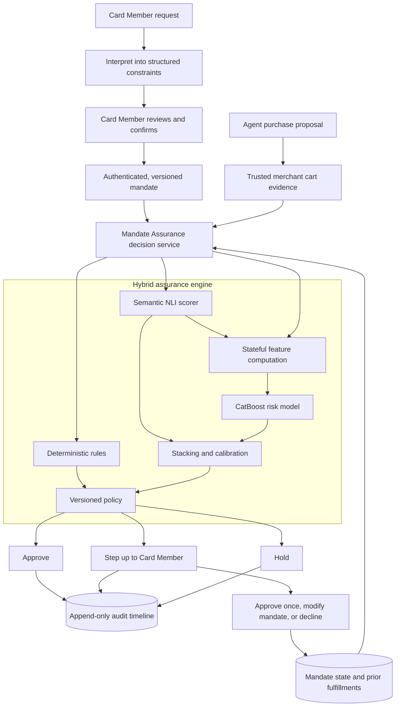

# ACE Mandate Assurance

> **Authenticate the agent. Verify the outcome.**

ACE Mandate Assurance is a simulated, ACE-aligned authorization-risk prototype for agentic commerce. It
checks whether an agent-proposed purchase—and the cumulative result of earlier purchases—still matches
the Card Member's authenticated intent before returning `APPROVE`, `STEP_UP`, or `HOLD`.

This project was designed for the American Express AI Hackathon 2026 under the **Protection** theme. It
is presented as a proposed intelligence module that could complement the intent, cart, authentication,
and authorization capabilities described publicly for Agentic Commerce Experiences (ACE).

> [!IMPORTANT]
> This is a local prototype. It uses synthetic identities, signatures, merchants, carts, and transactions.
> It does not connect to American Express systems, process real payments, or use real Card Member data.

## The problem

Agentic commerce introduces a risk that ordinary identity and payment controls do not fully address: an
agent can be genuine, registered, and technically authorized while still purchasing something materially
different from what the Card Member intended.

For example, a Card Member might ask an agent to:

> Book a refundable economy flight from Singapore to Tokyo, nonstop if available, for less than S$900.
> Do not purchase add-ons.

The agent could still propose:

- a cheaper but non-refundable fare;
- the correct flight with a hidden gift card, subscription, or insurance product;
- a flight above the approved budget;
- a cart whose refundability cannot be verified;
- a second purchase that causes cumulative spend to exceed the mandate; or
- an action produced after prompt injection, stale context, hallucination, or faulty planning.

A signed mandate proves what was authorized. Agent identity establishes who is acting. Static controls
can enforce amounts and categories. None of these, by themselves, guarantee that the final commercial
outcome still satisfies both the explicit and semantic parts of the request.

Mandate Assurance addresses that gap at the **action boundary**: immediately before the proposed payment
treatment. It evaluates the outcome regardless of whether the underlying deviation came from prompt
injection, a model error, merchant content, or malicious orchestration.

## Our solution

Mandate Assurance converts confirmed intent into a versioned mandate, evaluates trusted cart evidence,
tracks cumulative state, and combines deterministic and learned signals under an auditable policy.

The solution has five main ideas:

1. **Authenticate structured intent.** A natural-language request is interpreted into constraints, shown
   to the Card Member, and made authoritative only after explicit confirmation.
2. **Prefer trusted evidence.** Merchant-, PSP-, protocol-, or network-confirmed cart evidence is preferred
   over the agent's description of its own action.
3. **Use the right mechanism for each check.** Exact rules handle arithmetic, expiry, replay, route, dates,
   prohibited items, and cumulative limits. Semantic inference handles attributes such as refundability.
4. **Treat uncertainty proportionately.** Clear matches can approve, uncertain evidence steps up to the
   Card Member, and confirmed high-risk violations are held.
5. **Explain and reproduce every decision.** Rules, semantic scores, model versions, thresholds, evidence
   references, treatment, and Card Member resolution are stored in an append-only audit timeline.

### Simplified architecture



### Trust boundary

The agent is allowed to propose an action, but it is not trusted to supply the final description used to
validate that action. The decision service keeps these inputs separate:

| Input | Role | Trust treatment |
|---|---|---|
| Authenticated mandate | Records confirmed Card Member intent | Signed, immutable, and versioned |
| Agent proposal | Initiates the purchase workflow | Untrusted orchestration input |
| Cart evidence | Describes the actual commercial outcome | Must come from a recognized simulated trusted source |
| Mandate state | Records prior spend, fulfillments, and status | Updated transactionally with optimistic concurrency |
| Model artifacts | Produce semantic and structured-risk signals | Local, versioned, and checksum-verified |

Merchant text is always treated as data. It is never executed as an instruction by the decision service.

## How decisions are made

The API validates and normalizes the mandate, cart, evidence source, timestamps, monetary values, and
contract version. It then evaluates three complementary branches:

| Branch | What it evaluates | Prototype implementation |
|---|---|---|
| Deterministic rules | Budget, currency, route, dates, expiry, authorization, replay, prohibited items, fulfillment count, and cumulative spend | Pure Python rules with evidence-rich results |
| Semantic inference | Whether trusted evidence entails, contradicts, or fails to establish a required attribute | Deterministic offline scorer plus an artifact-only DeBERTa NLI adapter |
| Structured risk | Interactions between amounts, state utilization, missing evidence, semantic scores, categories, and rule results | CatBoost binary classifier |

CatBoost and semantic outputs can be combined through a logistic stacker and held-out calibrator. Models
produce evidence and probabilities; a deterministic, versioned policy always owns the final treatment.

The default policy behaves as follows:

| Condition | Treatment |
|---|---|
| Active mandate, trusted evidence, all required constraints satisfied, low calibrated risk | `APPROVE` |
| Remediable commercial violation, such as a single-cart budget excess | `STEP_UP` |
| Required evidence is missing or uncertain | `STEP_UP` |
| Semantic contradiction or calibrated model risk above the validated threshold | `STEP_UP` |
| Invalid/revoked/expired mandate, replay, cumulative breach, prohibited item/category, unauthorized merchant, or fulfillment-limit breach | `HOLD` |

The learned models are intentionally **escalation-only** at this stage. A calibrated score may move an
otherwise clean action from `APPROVE` to `STEP_UP`; it cannot produce `HOLD` by itself. Enabling a
model-only hold would require real pilot outcomes, an approved loss function, governance review, and a
new versioned policy artifact.

If a semantic model, structured model, calibration artifact, explanation layer, or state store is
unavailable, the service follows an explicit fail-safe path. It never silently invents evidence or treats
an uncalibrated score as calibrated.

## What is implemented

### Application

- A responsive Next.js Card Member and reviewer workspace.
- Mandate interpretation, review, simulated Ed25519 signing, confirmation, revocation, and immutable
  versioning.
- Six reproducible agent-transaction scenarios.
- Trusted-cart evidence display, decision reasons, expandable rule evidence, step-up resolution, and an
  append-only reviewer timeline.
- A frozen benchmark dashboard showing model quality, calibration, latency, and attack-family coverage.
- OpenAPI-generated TypeScript contracts to detect frontend/backend schema drift.

### Decision service

- FastAPI and strict Pydantic contracts with unsupported-version and malformed-input rejection.
- Scoped idempotency keys with conflicting-payload detection.
- Evidence-rich rules returning `PASS`, `WARN`, `FAIL`, or `NOT_EVALUABLE`.
- Risk-tiered policy and deterministic, evidence-bound explanation templates.
- Transactional fulfillment updates with optimistic row-version protection against stale concurrent writes.
- SQLite persistence managed by Alembic, including normalized mandates, constraints, carts, line items,
  decisions, signals, resolutions, model metadata, and audit events.

### Model and evaluation pipeline

- A strict canonical dataset schema with currency exponents, state, field-level real/synthetic provenance,
  parent/sequence identity, labels, review state, and grouping keys.
- Immutable, checksum-locked ESCI acquisition and a deterministic 60,000-row English-only Option 1
  builder. The mix is 50% source-backed single-item judgments, 20% source-grounded composite carts, 20%
  deterministic counterfactuals, and 10% independent-review queue.
- Option 2 adapters for Amazon-M2, UCI Online Retail II, BTS DB1B, and USAspending, plus a deterministic
  150,000-row builder using 70% public-record-backed examples and 30% grounded counterfactuals.
- A local two-reviewer annotation service and `/annotate` UI. Label provenance distinguishes human,
  LLM-consensus, mixed, and adjudicated outcomes; review data lives in its own SQLite database.
- Grouped 70/10/10/10 train, validation, calibration, and frozen golden splits. Parents, children, query
  groups, invoices, and sequences cannot cross splits.
- English three-way NLI fine-tuning with grouped out-of-fold predictions for training rows and a
  temperature chosen only on the calibration split.
- CatBoost, five-fold out-of-fold logistic stacking, held-out Platt calibration, and a validation-selected
  `STEP_UP` threshold. Fusion artifacts are JSON plus checksum-verified CatBoost, not executable pickle.
- One `features-v2` computation contract imported by both offline training and the live API, with a parity
  test that fails if the vectors diverge.
- Golden evaluation that uses only observable evidence. `attack_family` is retained solely for grouped
  reporting and cannot influence a prediction.
- TabM inclusion gate requiring measurable lift, acceptable calibration, and p95 latency below two seconds.

## Demo scenarios

The default UI uses the mandate described above. Each scenario has a deterministic expected outcome:

| Scenario | Proposed outcome | Expected treatment |
|---|---|---|
| Valid itinerary | Refundable, economy, nonstop, correct dates, S$840 | `APPROVE` |
| Hard violation | Matching itinerary at S$960 | `STEP_UP` |
| Semantic substitution | S$780 fare explicitly marked non-refundable | `STEP_UP` |
| Injected outcome | Flight plus an unrelated gift-card subscription | `HOLD` |
| Stateful violation | Two individually plausible S$500 fulfillments against S$900 total | First approves; second `HOLD` |
| Uncertain evidence | S$810 fare with no reliable refundability evidence | `STEP_UP` |

Create a fresh mandate before demonstrating each independent scenario so earlier approved fulfillments do
not intentionally affect later stateful checks.

## Repository layout

```text
apps/web/                 Next.js UI, component tests, and Playwright journeys
services/api/             FastAPI service, contracts, rules, policy, persistence, and migrations
ml/data/                  Canonical schema, public-source adapters, builders, reviews, and counterfactuals
ml/features/              Versioned structured feature computation
ml/semantic/              NLI pair construction, calibration, adapter, and artifact bootstrap
ml/tabular/               CatBoost training and TabM inclusion gate
ml/fusion/                Out-of-fold stacking and held-out calibration
ml/evaluation/            Metrics and frozen benchmark reporting
artifacts/manifests/      Version and policy metadata committed to source
artifacts/reports/        Generated benchmark summary consumed by the UI
tests/                    Dataset, leakage, feature-parity, semantic, calibration, and metric tests
docs/                     Threat model and presentation walkthrough
```

## Quick start with Docker

Requirements:

- Docker Desktop or another Docker Engine with Compose;
- approximately 3 GB of free space for the application images; and
- ports `3000` and `8000` available.

Start the complete application:

```bash
docker compose up --build
```

Then open:

- UI: <http://localhost:3000>
- API documentation: <http://localhost:8000/docs>
- API health: <http://localhost:8000/health>
- OpenAPI contract: <http://localhost:8000/openapi.json>

Stop the application while preserving the local database:

```bash
docker compose down
```

To permanently erase the local Docker database and start with a clean state:

```bash
docker compose down -v
docker compose up --build
```

> [!WARNING]
> `docker compose down -v` deletes the local prototype database volume.

The base Docker workflow requires no cloud credentials and uses the deterministic semantic/structured
fallback. A trained fusion bundle is loaded only when a promoted serving manifest **and** an explicitly
configured, version-matching semantic artifact are both present; this prevents serving a fusion model with
different semantic-score distributions than it saw in training.

## Develop and test locally

Install Python and JavaScript dependencies:

```bash
make install
```

Run all Python unit, contract, migration, concurrency, and evaluation tests plus frontend component tests:

```bash
make test
```

Run individual verification layers:

```bash
# Python linting
python3 -m ruff check services/api/app services/api/tests services/api/migrations ml tests

# Python tests
python3 -m pytest services/api/tests -q
python3 -m pytest tests -q

# Frontend component tests
npm --prefix apps/web test -- --run

# Production TypeScript build
npm --prefix apps/web run build

# Production dependency audit
npm --prefix apps/web audit --omit=dev
```

Install Chromium once, then run the browser suite:

```bash
npx --prefix apps/web playwright install chromium
npm --prefix apps/web run test:e2e
```

The Playwright suite covers all six user journeys plus an automated serious/critical accessibility audit.
It uses isolated ports `3100` and `8100`, so it does not accidentally test a stale Docker instance.

Regenerate frontend API types whenever Pydantic contracts change:

```bash
npm --prefix apps/web run types:api
```

## Build and review Option 1

Option 1 is the first real/public-data-backed training corpus. ESCI provides the real query, product title,
description, attributes, locale, and graded relevance judgment. It does **not** contain a Card Member
mandate, cart price, budget, cumulative state, or treatment, so those fields are generated deterministically
and marked synthetic at field level. This is deliberate: fabricating those fields is acceptable for
pipeline development, while presenting them as observed financial behavior would not be.

```bash
# About 1.16 GB; resolves the branch to an immutable commit and records every checksum.
make data-esci

# Streams the parquet join with DuckDB and writes exactly 60,000 en-US canonical rows.
make data-option1

# Re-parse every row and verify uniqueness, provenance, grouped splits, count, and hash.
make data-validate \
  DATASET=ml/data/generated/option1-en/ace-esci-en-hybrid.jsonl \
  MANIFEST=ml/data/generated/option1-en/manifest.json
```

Generated data is gitignored. `ml/data/generated/option1-en/manifest.json` records source revision, checksums,
row mix, locales, transformations, splits, review count, and final dataset hash.

Start the separate local review service and web UI:

```bash
make annotate-api
npm --prefix apps/web run dev
```

Open <http://localhost:3000/annotate>. Each of the 6,000 Option 1 review examples needs two independent
reviews. Disagreements enter the adjudication queue. The service is disabled by default and its SQLite
database is separate from the transaction-serving database.

For a scalable provisional pass, prepare two independent OpenAI Batch API jobs. Reviewer A uses the pinned
`gpt-5.4-2026-03-05` snapshot; reviewer B and disagreement adjudication use the pinned
`gpt-5.5-2026-04-23` snapshot. Both use strict JSON schemas. LLM labels are explicitly stored as
`llm_consensus` or `llm_adjudicated`, never as expert human labels.

```bash
python3 -m pip install -e 'services/api[annotation]'
cp .env.annotation.example .env.annotation
# Edit .env.annotation locally. Never commit it or paste the key into chat.

make llm-prepare
make llm-submit-a
make llm-submit-b
```

Use `python3 -m ml.data.llm_annotations status`, `download`, and `import` for each returned state file,
then `prepare-adjudication` for disagreements. Before any production claim, manually audit a stratified
sample and have a human resolve every audited mismatch. LLM consensus is useful training supervision but
is not a substitute for a human-owned golden set.

After review is complete, freeze labels into a new immutable JSONL rather than mutating the source corpus:

```bash
make export-reviews \
  DATASET=ml/data/generated/option1-en/ace-esci-en-hybrid.jsonl \
  REVIEWS=ml/data/annotations/reviews-option1-en.sqlite3 \
  OUTPUT=ml/data/generated/option1-en/ace-esci-en-hybrid-reviewed.jsonl
```

## Train the hybrid model pipeline

The 24 GB M4 Pro can run the English NLI fine-tune through PyTorch MPS with dynamic padding and activation
checkpointing. A local throughput benchmark found batch size 16 stable at roughly 6.97 examples/second and
about 4.1 GB of MPS driver memory. Five grouped folds plus the final model remain compute-heavy even though
memory is not the bottleneck. A CUDA host remains the faster fallback, not a prerequisite.

The selected English base is `MoritzLaurer/DeBERTa-v3-base-mnli-fever-anli` at commit
`6f5cf0a2b59cabb106aca4c287eed12e357e90eb`. It starts from real MNLI, FEVER-NLI, and ANLI data,
then is fine-tuned only on English public-evidence hybrid rows and the resolved review subset. CatBoost and the
fusion/calibrator are trained only on the resulting canonical feature rows; they are not pretrained on a
separate hidden dataset.

```bash
# On either the Mac or a GPU host
python3 -m pip install -e 'services/api[ml,semantic]'

# Download an immutable base model snapshot. A mutable branch name is rejected.
python3 -m ml.semantic.bootstrap \
  --repository MoritzLaurer/DeBERTa-v3-base-mnli-fever-anli \
  --revision 6f5cf0a2b59cabb106aca4c287eed12e357e90eb \
  --target artifacts/base-models/english-nli

# Produces grouped OOF predictions for train and held-out predictions elsewhere.
python3 -m ml.semantic.train_multilingual \
  --dataset ml/data/generated/option1-en/ace-esci-en-hybrid-reviewed.jsonl \
  --base-model artifacts/base-models/english-nli \
  --output artifacts/models/semantic-v2 \
  --batch-size 16 \
  --gradient-accumulation-steps 1 \
  --gradient-checkpointing \
  --prediction-batch-size 32

# Refuses to write a partial feature dataset if any semantic prediction is missing.
make features \
  DATASET=ml/data/generated/option1-en/ace-esci-en-hybrid-reviewed.jsonl \
  SEMANTIC_PREDICTIONS=artifacts/models/semantic-v2/semantic-predictions.jsonl \
  FEATURE_DATASET=ml/data/generated/features-v2.jsonl

make train-v2 FEATURE_DATASET=ml/data/generated/features-v2.jsonl
make evaluate-v2 FEATURE_DATASET=ml/data/generated/features-v2.jsonl

# Creates fusion-v2.serving.manifest.json only when the report is hash-bound and passed.
make promote-v2
```

The result is written to `artifacts/reports/evaluation-summary.json`. Manifests bind the source dataset,
semantic predictions, feature order, artifacts, calibration procedure, random seed, threshold, and every
checksum. The live API loads `fusion-v2.manifest.json`, verifies the CatBoost and JSON fusion artifacts,
and exposes the stacker/calibrator versions in every decision.

Training never marks its own output as serving-approved. The explicit promotion command verifies the
golden-gate status, dataset hash, artifact-manifest hash, and no-model-HOLD invariant. Docker looks only
for the promoted serving manifest; without it, the API uses the documented heuristic fallback. To run the
full artifact path in a semantic-enabled Python environment:

```bash
ACE_MODEL_MODE=artifact \
ACE_SEMANTIC_ARTIFACT=artifacts/models/semantic-v2 \
ACE_FUSION_MANIFEST=artifacts/models/fusion-v2.serving.manifest.json \
uvicorn app.main:app --app-dir services/api --port 8000
```

The API checks that the active semantic version is one of the versions bound into the fusion manifest and
returns a fail-safe service error on mismatch.

For a fast pipeline smoke test that does not claim real-world validity, `make evaluate` still builds the
small 300-row synthetic fixture. It exists to catch code regressions only and should not be promoted.

### Data mixture and why it is used

| Corpus | Size | Real/public portion | Synthetic portion | Purpose |
|---|---:|---|---|---|
| Option 1 ESCI hybrid | 60,000 | Queries, products, attributes, locales, relevance | Budgets, cart/state envelope, composites, counterfactuals | First actionable semantic + integrity model |
| Option 1 review subset | 6,000 (within 60k) | Two LLM passes + adjudication; later human audit | Synthetic mandate envelope remains explicit | Provisional weak-label correction; not human ground truth |
| Option 2 public benchmark | 150,000 | Amazon-M2, UCI transactions, DB1B itineraries, USAspending awards | Mandates for sources without intent plus grounded counterfactuals | Domain-transfer benchmark and pretraining |
| Option 2 expert subset | 4,000 (within 150k) | Human judgments over public evidence | Same explicit synthetic envelope | Cross-domain golden evaluation |

Option 2 is built only after its upstream files have been converted to each adapter's streaming
`records.jsonl` contract and locked in `ml/data/raw/option2/source-lock.json`. Run `make data-option2` to
produce the fixed 150k corpus. Adding a source changes an adapter and composition manifest, not the model's
`features-v2` definitions.

```bash
make data-option2-uci
make data-option2-db1b
make data-option2-usaspending # deterministic 2015-2025 contract-award search

# Amazon-M2 requires AIcrowd sign-in and acceptance of the dataset terms.
make data-option2-amazon AMAZON_SOURCE=/path/to/unpacked/amazon-m2
make data-option2
```

Amazon-M2 is session data, not ESCI relevance data. Its adapter uses the observed next product as a noisy
behavioral transition (`weak_session_transition`, confidence 0.55) and synthesizes the mandate from prior
session products. UCI, DB1B, and USAspending provide real transaction, itinerary, and award evidence but
also require synthetic mandate envelopes. These distinctions remain visible in field-level provenance.

## Security and prototype limitations

- Never use real PANs, credentials, Card Member records, or merchant secrets with this prototype.
- Demo signing keys are deterministic and are not suitable for any deployed environment.
- SQLite is appropriate for a local demonstration, not a production authorization workload.
- The deterministic mandate interpreter supports a constrained English template set.
- No real ACE, issuer, acquirer, PSP, merchant, identity-provider, or payment-network integration exists.
- Encryption at rest, HSM-backed key management, rate limiting, network authentication, regional retention,
  and data-localization enforcement belong to a future production environment.
- Missing history is treated as uncertainty, never as proof that a new or small merchant is risky.
- Protected characteristics are excluded from the feature set.

See [the threat model](docs/threat-model.md) for the trust assumptions and covered failure modes, and
[the data/ML pipeline contract](docs/data-ml-pipeline.md) for source, labeling, leakage, training, and
promotion invariants. The [demo script](docs/demo-script.md) contains a presentation walkthrough. The complete product rationale and
selected technical architecture are documented in [prd.md](prd.md) and [architecture.md](architecture.md).
