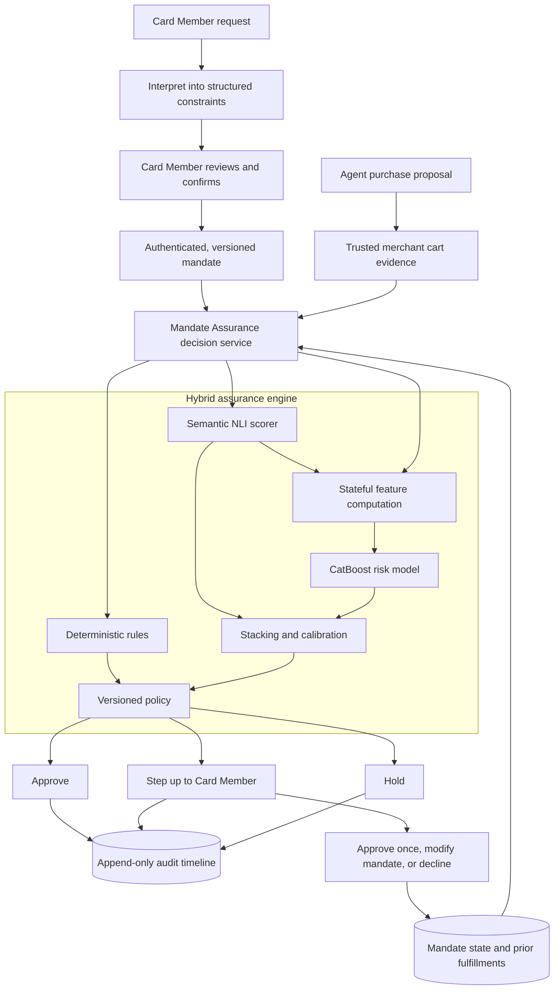

# ACE Mandate Assurance

> **Authenticate the agent. Verify the outcome.**

ACE Mandate Assurance is a simulated, ACE-aligned authorization-risk prototype for agentic commerce. It
checks whether an agent-proposed purchase—and the cumulative result of earlier purchases—still matches
the Card Member's authenticated intent before returning `APPROVE`, `STEP_UP`, or `HOLD`.

This project was designed for the American Express AI Hackathon 2026 under the **Protection** theme. It
is presented as a proposed intelligence module that could complement the intent, cart, authentication,
and authorization capabilities described publicly for Agentic Commerce Experiences (ACE).

> [!IMPORTANT]
> This is a local prototype. It uses synthetic identities, signatures, merchants, carts, and transactions.
> It does not connect to American Express systems, process real payments, or use real Card Member data.

## The problem

Agentic commerce introduces a risk that ordinary identity and payment controls do not fully address: an
agent can be genuine, registered, and technically authorized while still purchasing something materially
different from what the Card Member intended.

For example, a Card Member might ask an agent to:

> Book a refundable economy flight from Singapore to Tokyo, nonstop if available, for less than S$900.
> Do not purchase add-ons.

The agent could still propose:

- a cheaper but non-refundable fare;
- the correct flight with a hidden gift card, subscription, or insurance product;
- a flight above the approved budget;
- a cart whose refundability cannot be verified;
- a second purchase that causes cumulative spend to exceed the mandate; or
- an action produced after prompt injection, stale context, hallucination, or faulty planning.

A signed mandate proves what was authorized. Agent identity establishes who is acting. Static controls
can enforce amounts and categories. None of these, by themselves, guarantee that the final commercial
outcome still satisfies both the explicit and semantic parts of the request.

Mandate Assurance addresses that gap at the **action boundary**: immediately before the proposed payment
treatment. It evaluates the outcome regardless of whether the underlying deviation came from prompt
injection, a model error, merchant content, or malicious orchestration.

## Our solution

Mandate Assurance converts confirmed intent into a versioned mandate, evaluates trusted cart evidence,
tracks cumulative state, and combines deterministic and learned signals under an auditable policy.

The solution has five main ideas:

1. **Authenticate structured intent.** A natural-language request is interpreted into constraints, shown
   to the Card Member, and made authoritative only after explicit confirmation.
2. **Prefer trusted evidence.** Merchant-, PSP-, protocol-, or network-confirmed cart evidence is preferred
   over the agent's description of its own action.
3. **Use the right mechanism for each check.** Exact rules handle arithmetic, expiry, replay, route, dates,
   prohibited items, and cumulative limits. Semantic inference handles attributes such as refundability.
4. **Treat uncertainty proportionately.** Clear matches can approve, uncertain evidence steps up to the
   Card Member, and confirmed high-risk violations are held.
5. **Explain and reproduce every decision.** Rules, semantic scores, model versions, thresholds, evidence
   references, treatment, and Card Member resolution are stored in an append-only audit timeline.

### Simplified architecture



### Trust boundary

The agent is allowed to propose an action, but it is not trusted to supply the final description used to
validate that action. The decision service keeps these inputs separate:

| Input | Role | Trust treatment |
|---|---|---|
| Authenticated mandate | Records confirmed Card Member intent | Signed, immutable, and versioned |
| Agent proposal | Initiates the purchase workflow | Untrusted orchestration input |
| Cart evidence | Describes the actual commercial outcome | Must come from a recognized simulated trusted source |
| Mandate state | Records prior spend, fulfillments, and status | Updated transactionally with optimistic concurrency |
| Model artifacts | Produce semantic and structured-risk signals | Local, versioned, and checksum-verified |

Merchant text is always treated as data. It is never executed as an instruction by the decision service.

## How decisions are made

The API validates and normalizes the mandate, cart, evidence source, timestamps, monetary values, and
contract version. It then evaluates three complementary branches:

| Branch | What it evaluates | Prototype implementation |
|---|---|---|
| Deterministic rules | Budget, currency, route, dates, expiry, authorization, replay, prohibited items, fulfillment count, and cumulative spend | Pure Python rules with evidence-rich results |
| Semantic inference | Whether trusted evidence entails, contradicts, or fails to establish a required attribute | Deterministic offline scorer plus an artifact-only DeBERTa NLI adapter |
| Structured risk | Interactions between amounts, state utilization, missing evidence, semantic scores, categories, and rule results | CatBoost binary classifier |

CatBoost and semantic outputs can be combined through a logistic stacker and held-out calibrator. Models
produce evidence and probabilities; a deterministic, versioned policy always owns the final treatment.

The default policy behaves as follows:

| Condition | Treatment |
|---|---|
| Active mandate, trusted evidence, all required constraints satisfied, low calibrated risk | `APPROVE` |
| Remediable commercial violation, such as a single-cart budget excess | `STEP_UP` |
| Required evidence is missing or uncertain | `STEP_UP` |
| Invalid/revoked/expired mandate, replay, cumulative breach, prohibited item, or confirmed semantic contradiction | `HOLD` |

If a semantic model, structured model, calibration artifact, explanation layer, or state store is
unavailable, the service follows an explicit fail-safe path. It never silently invents evidence or treats
an uncalibrated score as calibrated.

## What is implemented

### Application

- A responsive Next.js Card Member and reviewer workspace.
- Mandate interpretation, review, simulated Ed25519 signing, confirmation, revocation, and immutable
  versioning.
- Six reproducible agent-transaction scenarios.
- Trusted-cart evidence display, decision reasons, expandable rule evidence, step-up resolution, and an
  append-only reviewer timeline.
- A frozen benchmark dashboard showing model quality, calibration, latency, and attack-family coverage.
- OpenAPI-generated TypeScript contracts to detect frontend/backend schema drift.

### Decision service

- FastAPI and strict Pydantic contracts with unsupported-version and malformed-input rejection.
- Scoped idempotency keys with conflicting-payload detection.
- Evidence-rich rules returning `PASS`, `WARN`, `FAIL`, or `NOT_EVALUABLE`.
- Risk-tiered policy and deterministic, evidence-bound explanation templates.
- Transactional fulfillment updates with optimistic row-version protection against stale concurrent writes.
- SQLite persistence managed by Alembic, including normalized mandates, constraints, carts, line items,
  decisions, signals, resolutions, model metadata, and audit events.

### Model and evaluation pipeline

- 50 curated seed mandates and 300 deterministic mandate-cart pairs.
- Valid, violating, and genuinely ambiguous examples across travel, retail, dining, recurring purchases,
  and small-business procurement.
- Grouped train, validation, calibration, and frozen golden splits that keep every seed's variants together.
- CatBoost primary model, five-fold out-of-fold stacking, held-out calibration, and thresholds chosen only
  from validation data.
- Three-way semantic-scoring interface that preserves contradiction, entailment, and neutral probabilities.
- Optional immutable-revision bootstrap for a local DeBERTa NLI artifact.
- TabM inclusion gate requiring measurable lift, acceptable calibration, and p95 latency below two seconds.

## Demo scenarios

The default UI uses the mandate described above. Each scenario has a deterministic expected outcome:

| Scenario | Proposed outcome | Expected treatment |
|---|---|---|
| Valid itinerary | Refundable, economy, nonstop, correct dates, S$840 | `APPROVE` |
| Hard violation | Matching itinerary at S$960 | `STEP_UP` |
| Semantic substitution | S$780 fare explicitly marked non-refundable | `HOLD` |
| Injected outcome | Flight plus an unrelated gift-card subscription | `HOLD` |
| Stateful violation | Two individually plausible S$500 fulfillments against S$900 total | First approves; second `HOLD` |
| Uncertain evidence | S$810 fare with no reliable refundability evidence | `STEP_UP` |

Create a fresh mandate before demonstrating each independent scenario so earlier approved fulfillments do
not intentionally affect later stateful checks.

## Repository layout

```text
apps/web/                 Next.js UI, component tests, and Playwright journeys
services/api/             FastAPI service, contracts, rules, policy, persistence, and migrations
ml/data/                  Synthetic seed and mandate-cart generation
ml/features/              Versioned structured feature computation
ml/semantic/              NLI pair construction, calibration, adapter, and artifact bootstrap
ml/tabular/               CatBoost training and TabM inclusion gate
ml/fusion/                Out-of-fold stacking and held-out calibration
ml/evaluation/            Metrics and frozen benchmark reporting
artifacts/manifests/      Version and policy metadata committed to source
artifacts/reports/        Generated benchmark summary consumed by the UI
tests/evaluation/         Dataset, leakage, feature, calibration, and metric tests
docs/                     Threat model and presentation walkthrough
```

## Quick start with Docker

Requirements:

- Docker Desktop or another Docker Engine with Compose;
- approximately 3 GB of free space for the application images; and
- ports `3000` and `8000` available.

Start the complete application:

```bash
docker compose up --build
```

Then open:

- UI: <http://localhost:3000>
- API documentation: <http://localhost:8000/docs>
- API health: <http://localhost:8000/health>
- OpenAPI contract: <http://localhost:8000/openapi.json>

Stop the application while preserving the local database:

```bash
docker compose down
```

To permanently erase the local Docker database and start with a clean state:

```bash
docker compose down -v
docker compose up --build
```

> [!WARNING]
> `docker compose down -v` deletes the local prototype database volume.

The Docker workflow requires no cloud credentials. When generated CatBoost artifacts exist, the API loads
and checksum-verifies them from the read-only artifact mount. Otherwise it falls back to the documented
deterministic structured scorer.

## Develop and test locally

Install Python and JavaScript dependencies:

```bash
make install
```

Run all Python unit, contract, migration, concurrency, and evaluation tests plus frontend component tests:

```bash
make test
```

Run individual verification layers:

```bash
# Python linting
python3 -m ruff check services/api/app services/api/tests services/api/migrations ml tests

# Python tests
python3 -m pytest services/api/tests tests -q

# Frontend component tests
npm --prefix apps/web test -- --run

# Production TypeScript build
npm --prefix apps/web run build

# Production dependency audit
npm --prefix apps/web audit --omit=dev
```

Install Chromium once, then run the browser suite:

```bash
npx --prefix apps/web playwright install chromium
npm --prefix apps/web run test:e2e
```

The Playwright suite covers all six user journeys plus an automated serious/critical accessibility audit.
It uses isolated ports `3100` and `8100`, so it does not accidentally test a stale Docker instance.

Regenerate frontend API types whenever Pydantic contracts change:

```bash
npm --prefix apps/web run types:api
```

## Reproduce the model benchmark

Generate the dataset, train CatBoost and the fusion/calibration artifacts, select thresholds from the
validation split, and evaluate the untouched golden split:

```bash
make evaluate
```

The result is written to `artifacts/reports/evaluation-summary.json`. Model binaries and generated datasets
are intentionally excluded from source control; their manifests record the dataset hash, feature order,
artifact checksum, random seed, calibration split, and policy thresholds.

The current controlled synthetic benchmark passes the selected gate of:

- at least 90% violation recall;
- no more than 10% false step-ups;
- no more than 2% false declines; and
- under two seconds p95 local decision latency after warm-up.

The present synthetic set is deliberately learnable and currently produces perfect classification and
treatment metrics. This is **not evidence of production performance**. Expected calibration error is
reported separately, and real deployment would require reviewed market-specific data, harder legitimate
alternatives, multilingual evaluation, drift monitoring, fairness analysis, and substantially larger
golden sets.

## Optional local NLI model

The normal demo is deterministic and offline. To evaluate the artifact-backed DeBERTa NLI adapter, install
the optional semantic dependencies and bootstrap an immutable model revision:

```bash
python3 -m pip install -e 'services/api[semantic]'
python3 -m ml.semantic.bootstrap --revision <immutable-hugging-face-commit>
```

The runtime adapter refuses network downloads and loads only local artifacts. Fine-tuning or model
selection should use mandate/evidence examples and a separate semantic calibration set rather than generic
similarity labels.

## Security and prototype limitations

- Never use real PANs, credentials, Card Member records, or merchant secrets with this prototype.
- Demo signing keys are deterministic and are not suitable for any deployed environment.
- SQLite is appropriate for a local demonstration, not a production authorization workload.
- The deterministic mandate interpreter supports a constrained English template set.
- No real ACE, issuer, acquirer, PSP, merchant, identity-provider, or payment-network integration exists.
- Encryption at rest, HSM-backed key management, rate limiting, network authentication, regional retention,
  and data-localization enforcement belong to a future production environment.
- Missing history is treated as uncertainty, never as proof that a new or small merchant is risky.
- Protected characteristics are excluded from the feature set.

See [the threat model](docs/threat-model.md) for the trust assumptions and covered failure modes, and
[the demo script](docs/demo-script.md) for a presentation walkthrough. The complete product rationale and
selected technical architecture are documented in [prd.md](prd.md) and [architecture.md](architecture.md).
