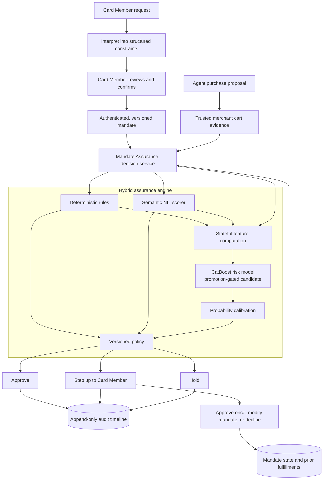

# ACE Mandate Assurance

> **Authenticate the agent. Verify the outcome.**

ACE Mandate Assurance is a simulated, ACE-aligned authorization-risk prototype for agentic commerce. It
checks whether an agent-proposed purchase—and the cumulative result of earlier purchases—still matches
the Card Member's authenticated intent before returning `APPROVE`, `STEP_UP`, or `HOLD`.

This project was designed for the American Express AI Hackathon 2026 under the **Protection** theme. It
is presented as a proposed intelligence module that could complement the intent, cart, authentication,
and authorization capabilities described publicly for Agentic Commerce Experiences (ACE).

> [!IMPORTANT]
> This is a local prototype. It uses synthetic identities, signatures, merchants, carts, and transactions.
> It does not connect to American Express systems, process real payments, or use real Card Member data.

> [!NOTE]
> The public project baseline is **development v3**. The architecture, data statements, metrics, and demo
> claims in this README refer only to that locked version. A future model may replace it only after passing
> every declared development, family-recall, calibration, friction, and independent-evaluation gate.
> The later Stage A, B, and C remediation candidates did not pass their declared semantic-recall gates,
> so they did not replace v3 or change the live decision architecture.
> For transparent demonstration, an explicit `development_artifact` runtime can execute the locked v3
> candidate end to end while preserving and displaying its `LOCKED_NON_PROMOTABLE` governance status.

## The problem

Agentic commerce introduces a risk that ordinary identity and payment controls do not fully address: an
agent can be genuine, registered, and technically authorized while still purchasing something materially
different from what the Card Member intended.

For example, a Card Member might ask an agent to:

> Book a refundable economy flight from Singapore to Tokyo, nonstop if available, for less than S$900.
> Do not purchase add-ons.

The agent could still propose:

- a cheaper but non-refundable fare;
- the correct flight with a hidden gift card, subscription, or insurance product;
- a flight above the approved budget;
- a cart whose refundability cannot be verified;
- a second purchase that causes cumulative spend to exceed the mandate; or
- an action produced after prompt injection, stale context, hallucination, or faulty planning.

A signed mandate proves what was authorized. Agent identity establishes who is acting. Static controls
can enforce amounts and categories. None of these, by themselves, guarantee that the final commercial
outcome still satisfies both the explicit and semantic parts of the request.

Mandate Assurance addresses that gap at the **action boundary**: immediately before the proposed payment
treatment. It evaluates the outcome regardless of whether the underlying deviation came from prompt
injection, a model error, merchant content, or malicious orchestration.

## Our solution

Mandate Assurance converts confirmed intent into a versioned mandate, evaluates trusted cart evidence,
tracks cumulative state, and combines deterministic and learned signals under an auditable policy.

The solution has five main ideas:

1. **Authenticate structured intent.** A natural-language request is interpreted into constraints, shown
   to the Card Member, and made authoritative only after explicit confirmation.
2. **Prefer trusted evidence.** Merchant-, PSP-, protocol-, or network-confirmed cart evidence is preferred
   over the agent's description of its own action.
3. **Use the right mechanism for each check.** Exact rules handle arithmetic, expiry, replay, route, dates,
   prohibited items, and cumulative limits. Semantic inference handles attributes such as refundability.
4. **Treat uncertainty proportionately.** Clear matches can approve, uncertain evidence steps up to the
   Card Member, and confirmed high-risk violations are held.
5. **Explain and reproduce every decision.** Rules, semantic scores, model versions, thresholds, evidence
   references, treatment, and Card Member resolution are stored in an append-only audit timeline.

### Simplified architecture



### Trust boundary

The agent is allowed to propose an action, but it is not trusted to supply the final description used to
validate that action. The decision service keeps these inputs separate:

| Input | Role | Trust treatment |
|---|---|---|
| Authenticated mandate | Records confirmed Card Member intent | Signed, immutable, and versioned |
| Agent proposal | Initiates the purchase workflow | Untrusted orchestration input |
| Cart evidence | Describes the actual commercial outcome | Ed25519-signed by a recognized simulated evidence issuer; content changes invalidate trust |
| Mandate state | Records prior spend, fulfillments, and status | Updated transactionally with optimistic concurrency |
| Model artifacts | Produce semantic and structured-risk signals | Local, versioned, and checksum-verified |

Merchant text is always treated as data. It is never executed as an instruction by the decision service.

## How decisions are made

The API validates and normalizes the mandate, cart, evidence source, timestamps, monetary values, and
contract version. It then evaluates three complementary branches:

| Branch | What it evaluates | Prototype implementation |
|---|---|---|
| Deterministic rules | Budget, currency, route, dates, expiry, authorization, replay, prohibited items, fulfillment count, and cumulative spend | Pure Python rules with evidence-rich results |
| Semantic inference | Whether trusted evidence entails, contradicts, or fails to establish a required attribute | Deterministic offline scorer plus an artifact-only DeBERTa NLI adapter |
| Structured risk | Interactions between amounts, state utilization, missing evidence, semantic scores, categories, and rule results | CatBoost binary classifier |

The current development architecture supplies semantic probabilities and deterministic rule summaries as
CatBoost input features, then calibrates CatBoost with a separately fitted Platt calibrator. Semantic and
rule results also remain independently visible to policy; the model cannot hide or overrule them. The
earlier logistic stacker reduced quality and is not the selected path. Fusion remains a research option
only if it adds an independently trained, leakage-safe signal and passes non-degradation gates. Models
produce evidence and probabilities; a deterministic, versioned policy always owns the final treatment.

The default policy behaves as follows:

| Condition | Treatment |
|---|---|
| Active mandate, trusted evidence, all required constraints satisfied, low calibrated risk | `APPROVE` |
| Remediable commercial violation, such as a single-cart budget excess | `STEP_UP` |
| Required evidence is missing or uncertain | `STEP_UP` |
| Semantic contradiction or calibrated model risk above the validated threshold | `STEP_UP` |
| Invalid/revoked/expired mandate, replay, cumulative breach, prohibited item/category, unauthorized merchant, or fulfillment-limit breach | `HOLD` |

The learned models are intentionally **escalation-only** at this stage. A calibrated score may move an
otherwise clean action from `APPROVE` to `STEP_UP`; it cannot produce `HOLD` by itself. Enabling a
model-only hold would require real pilot outcomes, an approved loss function, governance review, and a
new versioned policy artifact.

If a semantic model, structured model, calibration artifact, explanation layer, or state store is
unavailable, the service follows an explicit fail-safe path. It never silently invents evidence or treats
an uncalibrated score as calibrated.

## What is implemented

### Application

- A responsive Next.js Card Member and reviewer workspace.
- Mandate interpretation, review, simulated Ed25519 signing, confirmation, revocation, and immutable
  versioning.
- Six reproducible, isolated agent-transaction scenarios with guided progress and one-click reset.
- Server-issued, Ed25519-signed demo-cart evidence, decision reasons, expandable rule evidence, step-up resolution, and an
  append-only reviewer timeline.
- Card Member resolution through approve-once, mandate replacement, or decline.
- A development-v3 evidence dashboard showing exact model quality, calibration, gate results, and the
  locked non-promotable status.
- OpenAPI-generated TypeScript contracts to detect frontend/backend schema drift.
- An active-runtime strip and per-decision contract showing the exact NLI, CatBoost, calibrator, threshold,
  candidate gate, policy version, and cart-signature result used for that decision.

### Decision service

- FastAPI and strict Pydantic contracts with unsupported-version and malformed-input rejection.
- Scoped idempotency keys with conflicting-payload detection.
- Evidence-rich rules returning `PASS`, `WARN`, `FAIL`, or `NOT_EVALUABLE`.
- Risk-tiered policy and deterministic, evidence-bound explanation templates.
- Transactional fulfillment updates with optimistic row-version protection against stale concurrent writes.
- SQLite persistence managed by Alembic, including normalized mandates, constraints, carts, line items,
  decisions, signals, resolutions, model metadata, and audit events.
- A checksum- and candidate-lock-bound development runtime for the frozen English NLI model, CatBoost
  candidate, Platt calibrator, and policy-tuning threshold. Startup fails if any binding is inconsistent.

### Model and evaluation pipeline

- A strict canonical dataset schema with currency exponents, state, field-level real/synthetic provenance,
  parent/sequence identity, labels, review state, and grouping keys.
- Immutable, checksum-locked ESCI acquisition and a deterministic 60,000-row English-only Option 1
  builder. The mix is 50% source-backed single-item judgments, 20% source-grounded composite carts, 20%
  deterministic counterfactuals, and 10% independent-review queue.
- Option 2 adapters for Amazon-M2, UCI Online Retail II, BTS DB1B, and USAspending, plus a deterministic
  150,000-row builder using 70% public-record-backed examples and 30% grounded counterfactuals.
- A local two-reviewer annotation service and `/annotate` UI. Label provenance distinguishes human,
  LLM-consensus, mixed, and adjudicated outcomes; review data lives in its own SQLite database.
- A relationship-isolated 7,000-row development-v3 selection with 4,000 `train_fit`, 1,000 `calibration`,
  1,000 `policy_tuning`, and 1,000 `candidate_selection` rows. Parents, children, source records, query
  groups, invoices, and sequences cannot cross roles.
- English three-way NLI fine-tuning with grouped out-of-fold predictions for training rows and a
  temperature chosen only on the calibration split. The latest v3 run freezes this artifact and performs
  inference only.
- CatBoost fitted only on `train_fit`, separate Platt calibration, and a policy threshold selected only on
  `policy_tuning`. The selected calibrated CatBoost is a development candidate, not a serving artifact.
- One shared commercial-rule core consumed by offline features and the live API, with parity and boundary
  tests that fail if comparable rule results diverge.
- Golden evaluation that uses only observable evidence. `attack_family` is retained solely for grouped
  reporting and cannot influence a prediction.
- Optional fusion and challenger gates requiring measurable lift, leakage-safe construction, acceptable
  calibration, and acceptable latency.

## Demo scenarios

The default UI uses the mandate described above. Each scenario has a deterministic expected outcome:

| Scenario | Proposed outcome | Expected treatment |
|---|---|---|
| Valid itinerary | Refundable, economy, nonstop, correct dates, S$840 | `APPROVE` |
| Budget excess | Matching itinerary at S$960 | `STEP_UP` |
| Semantic substitution | S$780 fare explicitly marked non-refundable | `STEP_UP` |
| Injected outcome | Flight plus an unrelated gift-card subscription | `HOLD` |
| Stateful violation | Two individually plausible S$500 fulfillments against S$900 total | First approves; second `HOLD` |
| Uncertain evidence | S$810 fare with no reliable refundability evidence | `STEP_UP` |

The UI automatically creates an isolated copy of the confirmed mandate for each scenario, so an earlier
approval cannot change a later example. The stateful scenario deliberately keeps both S$500 transactions
inside one isolated session and displays the first approval followed by the second `HOLD`.

## Repository layout

```text
apps/web/                 Next.js UI, component tests, and Playwright journeys
services/api/             FastAPI service, contracts, rules, policy, persistence, and migrations
services/api/data/        Tracked development-v3 presentation summary consumed by the demo API
ml/data/                  Canonical schema, public-source adapters, builders, reviews, and counterfactuals
ml/features/              Versioned structured feature computation
ml/semantic/              NLI pair construction, calibration, adapter, and artifact bootstrap
ml/tabular/               CatBoost training and TabM inclusion gate
ml/fusion/                Out-of-fold stacking and held-out calibration
ml/evaluation/            Metrics and frozen benchmark reporting
artifacts/manifests/      Version and policy metadata committed to source
artifacts/reports/        Gitignored generated research and evaluation reports
tests/                    Dataset, leakage, feature-parity, semantic, calibration, and metric tests
docs/                     Threat model and presentation walkthrough
```

## Quick start with Docker

Requirements:

- Docker Desktop or another Docker Engine with Compose;
- approximately 3 GB of free space for the application images; and
- ports `3000` and `8000` available.

Start the complete application:

```bash
docker compose up --build
```

Then open:

- UI: <http://localhost:3000>
- API documentation: <http://localhost:8000/docs>
- API health: <http://localhost:8000/health>
- OpenAPI contract: <http://localhost:8000/openapi.json>

Stop the application while preserving the local database:

```bash
docker compose down
```

To permanently erase the local Docker database and start with a clean state:

```bash
docker compose down -v
docker compose up --build
```

> [!WARNING]
> `docker compose down -v` deletes the local prototype database volume.

The base Docker workflow requires no cloud credentials and uses the deterministic semantic/structured
fallback. A trained fusion bundle is loaded only when a promoted serving manifest **and** an explicitly
configured, version-matching semantic artifact are both present; this prevents serving a fusion model with
different semantic-score distributions than it saw in training.

### Run the complete development-v3 artifact path

This mode is for the hackathon demonstration and local engineering verification. It executes the real
frozen development artifacts; it does not relabel the candidate as production-promotable.

For the presentation, use the single stable launcher. It builds the production web app, starts both
services without source reloaders, checks readiness, and prints the verified runtime contract:

```bash
make pitch-demo
```

Then open <http://127.0.0.1:3000> and choose **Start 90-second guided demo**. Press `Ctrl+C` in the launcher
terminal to stop both services.

```bash
python3 -m pip install -e 'services/api[semantic,model-runtime]'
make verify-artifact-runtime
npm --prefix apps/web run test:e2e:artifact

# Terminal 1: checksum verification, model loading, and API
make demo-artifact-api

# Terminal 2: web workspace
npm --prefix apps/web run dev
```

Open <http://localhost:3000>. The header and every decision report
`english-nli-v3`, `catboost-v1`, `platt-calibrator-v3`, threshold `0.7599186405522896`, signed-cart
verification, and the unchanged `LOCKED_NON_PROMOTABLE` candidate status. No external AI API or cloud
credential is required; all model inference is local.

API startup applies the Alembic schema automatically. A recognized pre-Alembic prototype database is
stamped and upgraded without deleting its rows; the compatibility migration initializes the concurrency
`row_version` to zero for existing mandate state. Unknown schema differences stop startup with an explicit
error instead of being silently overwritten.

### Deploy the lightweight public demo on Render

The public Round 1 deployment is deliberately smaller than the full local artifact runtime. One Docker
service hosts both the exported judge interface and FastAPI behind the same URL. It retains authenticated
mandates, signed simulated-cart evidence, deterministic semantic and structured safeguards, stateful policy,
and the audit trail, while omitting PyTorch, Transformers, CatBoost, and the 776 MB semantic artifact. The
interface labels this boundary as **Lightweight public demo · deterministic runtime**; offline development
metrics remain separately labelled and promotion-gated.

The root [`Dockerfile`](Dockerfile) and [`render.yaml`](render.yaml) define the free Render service. Validate
the deployment contract with:

```bash
render blueprints validate render.yaml
docker build -t ace-mandate-assurance-public-demo .
docker run --rm -p 10000:10000 ace-mandate-assurance-public-demo
npm --prefix apps/web run test:e2e:public
```

Then open <http://127.0.0.1:10000>. Render creates the public service from the Git-backed repository:

```bash
render services create \
  --name ace-mandate-assurance-demo \
  --type web_service \
  --repo https://github.com/Aaryan126/AMEX_Mandate_Assurance.git \
  --runtime docker \
  --plan free \
  --region oregon \
  --health-check-path /health \
  --env-var ACE_MODEL_MODE=heuristic \
  --env-var ACE_DATABASE_URL=sqlite:////tmp/ace-public-demo.sqlite3 \
  --env-var ACE_WEB_STATIC_DIR=/workspace/apps/web/out \
  --output json
```

Free Render filesystems are ephemeral, so demo history resets after a restart or idle spin-down. This is
intentional for the synthetic public walkthrough; the production architecture replaces SQLite with managed
persistent storage.

## Develop and test locally

Install Python and JavaScript dependencies:

```bash
make install
```

Run all Python unit, contract, migration, concurrency, and evaluation tests plus frontend component tests:

```bash
make test
```

Run individual verification layers:

```bash
# Python linting
python3 -m ruff check services/api/app services/api/tests services/api/migrations ml tests

# Python tests
python3 -m pytest services/api/tests -q
python3 -m pytest tests -q

# Frontend component tests
npm --prefix apps/web test -- --run

# Production TypeScript build
npm --prefix apps/web run build

# Production dependency audit
npm --prefix apps/web audit --omit=dev
```

Install Chromium once, then run the browser suite:

```bash
npx --prefix apps/web playwright install chromium
npm --prefix apps/web run test:e2e
```

The Playwright suite covers all six user journeys plus an automated serious/critical accessibility audit.
It uses isolated ports `3100` and `8100`, so it does not accidentally test a stale Docker instance.

Regenerate frontend API types whenever Pydantic contracts change:

```bash
npm --prefix apps/web run types:api
```

## Build and review Option 1

Option 1 is the first real/public-data-backed training corpus. ESCI provides the real query, product title,
description, attributes, locale, and graded relevance judgment. It does **not** contain a Card Member
mandate, cart price, budget, cumulative state, or treatment, so those fields are generated deterministically
and marked synthetic at field level. This is deliberate: fabricating those fields is acceptable for
pipeline development, while presenting them as observed financial behavior would not be.

```bash
# About 1.16 GB; resolves the branch to an immutable commit and records every checksum.
make data-esci

# Streams the parquet join with DuckDB and writes exactly 60,000 en-US canonical rows.
make data-option1

# Re-parse every row and verify uniqueness, provenance, grouped splits, count, and hash.
make data-validate \
  DATASET=ml/data/generated/option1-en/ace-esci-en-hybrid.jsonl \
  MANIFEST=ml/data/generated/option1-en/manifest.json
```

Generated data is gitignored. `ml/data/generated/option1-en/manifest.json` records source revision, checksums,
row mix, locales, transformations, splits, review count, and final dataset hash.

Start the separate local review service and web UI:

```bash
make annotate-api
npm --prefix apps/web run dev
```

Open <http://localhost:3000/annotate>. Each of the 6,000 Option 1 review examples needs two independent
reviews. Disagreements enter the adjudication queue. The service is disabled by default and its SQLite
database is separate from the transaction-serving database.

For a scalable provisional pass, prepare two independent OpenAI Batch API jobs. Reviewer A uses the pinned
`gpt-5.4-mini-2026-03-17` snapshot, reviewer B uses `gpt-4.1-mini-2025-04-14`, and only disagreements go to
the full `gpt-5.4-2026-03-05` adjudicator. Both passes use strict JSON schemas. LLM labels are stored as
`llm_consensus` or `llm_adjudicated`, never as expert human labels.

```bash
python3 -m pip install -e 'services/api[annotation]'
cp .env.annotation.example .env.annotation
# Edit .env.annotation locally. Never commit it or paste the key into chat.

make llm-prepare
make llm-submit-a
make llm-submit-b
```

Use `python3 -m ml.data.llm_annotations status`, `download`, and `import` for each returned state file,
then `prepare-adjudication` for disagreements. Before any production claim, manually audit a stratified
sample and have a human resolve every audited mismatch. LLM consensus is useful training supervision but
is not a substitute for a human-owned golden set.

### Human validation still required for production claims

Development v3 includes an LLM-assisted audit with explicit provenance; it is not represented as expert
human ground truth. Before making a production-readiness claim, independently review a stratified,
blinded sample spanning label provenance, counterfactual families, and real versus hybrid-grounded
evidence. Reviewers must not see source labels, transformation metadata, model predictions, or one
another's decisions. Disagreements require independent adjudication, and the resulting agreement report
must remain checksum-bound to the reviewed rows.

This genuine human audit has **not** been completed. To keep provisional v3 development moving, a
400-row blinded queue was instead processed by pinned GPT-5.4 mini and GPT-4.1 mini reviewers. They
agreed on 194 rows, and pinned GPT-5.4 adjudicated all 206 disagreements. The measured Batch API cost was
approximately US$2.62. The result is explicitly recorded as `llm_assisted_not_human`; it contains zero
genuine human-reviewed rows and is not eligible to support a production or promotion claim. Only 81 of
these audited labels entered development-v3 after relationship and data-isolation exclusions.

After review is complete, freeze labels into a new immutable JSONL rather than mutating the source corpus:

```bash
make export-reviews \
  DATASET=ml/data/generated/option1-en/ace-esci-en-hybrid.jsonl \
  REVIEWS=ml/data/annotations/reviews-option1-en.sqlite3 \
  OUTPUT=ml/data/generated/option1-en/ace-esci-en-hybrid-reviewed.jsonl
```

## Reproduce the development-v3 baseline

The 24 GB M4 Pro can run the English NLI fine-tune through PyTorch MPS with dynamic padding and activation
checkpointing. A local throughput benchmark found batch size 16 stable at roughly 6.97 examples/second and
about 4.1 GB of MPS driver memory. Five grouped folds plus the final model remain compute-heavy even though
memory is not the bottleneck. A CUDA host remains the faster fallback, not a prerequisite.

The selected English base is `MoritzLaurer/DeBERTa-v3-base-mnli-fever-anli` at commit
`6f5cf0a2b59cabb106aca4c287eed12e357e90eb`. It starts from real MNLI, FEVER-NLI, and ANLI data,
was domain-adapted on an approximately 10,000-row Option 2 public-data hybrid sample, and was then
fine-tuned and validated with grouped folds on the reviewed English Option 1 corpus. In the
latest development-v3 run this semantic artifact was frozen and used only for inference. CatBoost and its
calibrator are trained only on resulting canonical Option 1 feature rows; there is no separate hidden
training dataset.

The locked v3 baseline is split into independently checksum-bound artifacts:

| Artifact | Location |
|---|---|
| Development dataset and role manifest | `ml/data/generated/development-v3/` |
| Frozen semantic model | Checksum recorded in the v3 checkpoint |
| Semantic predictions and canonical features | `ml/data/generated/development-v3/` |
| CatBoost model and manifest | `artifacts/models/development-v3-catboost/` |
| Platt calibrator, policy result, and candidate lock | `artifacts/models/development-v3-baselines/` |

Generated datasets and model weights are intentionally gitignored. Their immutable hashes, recovery archive,
and verification results are recorded in
[`docs/development-v3-checkpoint.md`](docs/development-v3-checkpoint.md). Rebuild the public-data source and
relationship-isolated development roles with:

```bash
python3 -m pip install -e 'services/api[ml,semantic]'
make data-option1-v3
make data-development-v3
make test
```

The v3 training contract uses 4,000 `train_fit` rows, 1,000 calibration rows, 1,000 policy-tuning rows,
and a 1,000-row candidate-selection role. Relationship groups cannot cross these roles. Training never
marks its own output as serving-approved, and the locked v3 candidate did not create a serving manifest
because it missed the recall gates. The default Docker demo therefore exercises the v3 policy contract
through the deterministic semantic/structured fallback. The explicit local `development_artifact` mode
can execute those exact artifacts for an end-to-end demonstration, but exposes the failed promotion status
and must not be described as production serving.

### Current development-v3 result

The v3 development run rebuilt Option 1 with `grounded-counterfactual-v3`, selected 7,000
relationship-isolated rows, and reused the completed English semantic model as a frozen feature generator.
It trained CatBoost only on `train_fit`, fitted Platt calibration only on `calibration`, selected the
`STEP_UP` threshold only on `policy_tuning`, and reported architecture metrics only on
`candidate_selection`.

On the 1,000-row candidate-selection role, calibrated CatBoost produced:

| Metric | Result | Gate |
|---|---:|---:|
| PR-AUC | 0.96668 | Diagnostic ranking metric |
| Brier score | 0.08719 | Lower is better |
| Expected calibration error | 0.02523 | At most 0.08; passed |
| Operational recall | 79.93% | At least 90%; failed |
| False-step-up rate | 9.03% | At most 10%; passed |
| False-decline rate | 0% | At most 2%; passed |
| Adequately supported untransformed-family recall | 41.46% | At least 80%; failed |

The candidate is therefore `LOCKED_NON_PROMOTABLE`. The 0.96668 development PR-AUC demonstrates that the
model learns the v3 development target; it does not demonstrate production generalization.

For a fast pipeline smoke test that does not claim real-world validity, `make evaluate` still builds the
small 300-row synthetic fixture. It exists to catch code regressions only and should not be promoted.

### Data mixture, provenance, and status

| Corpus | Size | Real/public evidence | Synthetic portion | Status and purpose |
|---|---:|---|---|---|
| Option 1 ESCI hybrid | 60,000 | Queries, products, attributes, locales, relevance | Budgets, cart/state envelope, composites, counterfactuals | Built; primary English source pool |
| Development v3 | 7,000 | 3,872 `real_public` rows; all rows inherit public ESCI evidence | Synthetic operational envelope on every row; 3,128 explicitly `hybrid_grounded` rows | Built; CatBoost development only |
| V3 assisted audit | 400 | Blinded public-evidence examples | Synthetic operational envelope remains explicit | Completed by LLM reviewers; not human validation; 81 labels selected into development v3 |
| Option 1 review queue | 6,000 (within 60k) | Public ESCI evidence | Synthetic mandate envelope remains explicit | Provisional review pool; not human ground truth |
| Option 2 public benchmark | 150,000 | Amazon-M2, UCI transactions, DB1B itineraries, USAspending awards | Mandates for sources without intent plus grounded counterfactuals | Built for domain transfer, benchmark work, and semantic pretraining |
| Option 2 expert subset | 4,000 (planned within 150k) | Planned human judgments over public evidence | Same explicit synthetic envelope | Not completed; future cross-domain golden evaluation |

Within development v3, label provenance is 3,856 weak policy-v3 rows (55.09%), 3,063 deterministic
policy-v3 rows (43.76%), and 81 LLM-assisted rows (1.16%). The `real_public` classification does not mean a
real Amex financial transaction: ESCI supplies real public query/product evidence, while mandate, budget,
cart-state, and treatment fields remain synthetic. No real Amex Card Member or transaction data is used.

Option 2 is built only after its upstream files have been converted to each adapter's streaming
`records.jsonl` contract and locked in `ml/data/raw/option2/source-lock.json`. Run `make data-option2` to
produce the fixed 150k corpus. Adding a source changes an adapter and composition manifest, not the model's
canonical feature schema.

```bash
make data-option2-uci
make data-option2-db1b
make data-option2-usaspending # deterministic 2015-2025 contract-award search

# Amazon-M2 requires AIcrowd sign-in and acceptance of the dataset terms.
make data-option2-amazon AMAZON_SOURCE=/path/to/unpacked/amazon-m2
make data-option2
```

Amazon-M2 is session data, not ESCI relevance data. Its adapter uses the observed next product as a noisy
behavioral transition (`weak_session_transition`, confidence 0.55) and synthesizes the mandate from prior
session products. UCI, DB1B, and USAspending provide real transaction, itinerary, and award evidence but
also require synthetic mandate envelopes. These distinctions remain visible in field-level provenance.

## Security and prototype limitations

- Never use real PANs, credentials, Card Member records, or merchant secrets with this prototype.
- Demo signing keys are deterministic and are not suitable for any deployed environment.
- SQLite is appropriate for a local demonstration, not a production authorization workload.
- The deterministic mandate interpreter supports a constrained English template set.
- No real ACE, issuer, acquirer, PSP, merchant, identity-provider, or payment-network integration exists.
- Encryption at rest, HSM-backed key management, rate limiting, network authentication, regional retention,
  and data-localization enforcement belong to a future production environment.
- Missing history is treated as uncertainty, never as proof that a new or small merchant is risky.
- Protected characteristics are excluded from the feature set.

See [the threat model](docs/threat-model.md) for the trust assumptions and covered failure modes, and
[the data/ML pipeline contract](docs/data-ml-pipeline.md) for source, labeling, leakage, training, and
promotion invariants. The [demo script](docs/demo-script.md) contains a presentation walkthrough. The complete product rationale and
selected technical architecture are documented in [prd.md](prd.md) and [architecture.md](architecture.md).
