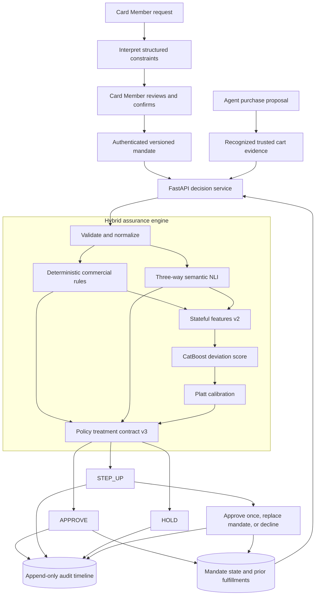

# ACE Mandate Assurance — Final Prototype Architecture

## Status

This document is the architecture source of truth for the current prototype.

**Last reconciled with the repository:** 2026-08-24.

- **Selected public baseline:** development v3.
- **Architecture status:** stable and expected to be final for the hackathon submission.
- **Learned-model status:** `LOCKED_NON_PROMOTABLE`; the calibrated CatBoost candidate missed the declared
  operational- and family-recall gates.
- **Live demo status:** the default Docker configuration uses the deterministic semantic/structured fallback
  under the same policy contract. No learned model artifact is represented as production-serving.
- **Later experiments:** development-v4 Stages A, B, and C did not pass their predeclared semantic-recall
  gates. They are retained as research evidence and did not replace v3 or change the live architecture.

This is a simulated, ACE-aligned prototype. It does not integrate with American Express systems, process
real payments, or use real Card Member data.

## Architecture decision

The final prototype uses a layered hybrid decision architecture:

1. A Card Member confirms a structured, versioned mandate.
2. An agent may propose a purchase, but the decision service evaluates recognized merchant/cart evidence
   rather than trusting the agent's description of the outcome.
3. Exact constraints are handled by deterministic rules.
4. A three-way NLI scorer evaluates fuzzy language requirements.
5. Stateful, rule, cart, and semantic signals form the structured feature vector.
6. The selected development model is CatBoost followed by Platt calibration.
7. A deterministic, versioned policy owns the final `APPROVE`, `STEP_UP`, or `HOLD` treatment.
8. The decision, evidence, model versions, and later Card Member resolution are persisted in an audit
   timeline; approved fulfillments update mandate state transactionally.



The learned branch in this diagram describes the selected development architecture. Artifact-backed runtime
scoring must be explicitly enabled with compatible, checksum-valid local artifacts; the combined fusion
loader additionally requires an explicitly promoted serving manifest. Because v3 is non-promotable, its
CatBoost/Platt pair is kept as offline evidence and the default demo uses fallback scorers while preserving
the same rules, policy, treatments, state transitions, and audit contract.

## Trust boundary

| Input | Purpose | Trust treatment |
|---|---|---|
| Authenticated mandate | Authoritative Card Member intent | Confirmed, signed in the simulation, immutable, and versioned |
| Agent proposal | Starts the purchase workflow | Untrusted orchestration input |
| Cart evidence | Describes the commercial outcome | Must use a recognized simulated trusted source |
| Mandate state | Tracks prior spend, fulfillments, status, and replay | Persisted and updated transactionally with optimistic concurrency |
| Model artifacts | Produce semantic and risk signals | Local, versioned, checksum-verified, and promotion-gated |

Merchant and agent text are always data. The decision service never executes them as instructions.

## Online decision flow

### 1. Interpret and authenticate intent

The constrained interpreter turns a natural-language request into a mandate proposal. The proposal becomes
authoritative only after explicit Card Member confirmation, after which the service records an authorization
reference and immutable mandate version.

### 2. Validate trusted inputs

FastAPI and Pydantic reject malformed or unsupported contracts, monetary values, timestamps, currencies,
and identifiers. Idempotency keys are scoped to an operation; reuse with a different payload is rejected.
Missing security-critical evidence is recorded explicitly and is never silently imputed.

### 3. Evaluate deterministic constraints

The shared commercial-rule core handles objective facts such as:

- mandate authorization, status, validity window, and replay;
- single-cart and cumulative budget limits;
- fulfillment limits;
- currencies, routes, travel dates, merchants, and categories;
- prohibited items or categories; and
- evidence availability.

Each rule produces `PASS`, `WARN`, `FAIL`, or `NOT_EVALUABLE` with observed and expected evidence. The live
service and offline feature pipeline share this logic to prevent training/serving drift.

### 4. Evaluate semantic constraints

Required natural-language attributes are evaluated as premise/hypothesis pairs with contradiction,
entailment, and neutral probabilities. Neutral is kept as a first-class outcome because it represents
insufficient evidence and normally requires Card Member step-up.

Development v3 freezes the English `english-nli-v3` artifact and uses its probabilities as inputs; it does
not retrain that model within the v3 dataset roles. The Docker demo uses a deterministic offline semantic
fallback unless a compatible artifact mode is explicitly configured.

### 5. Compute structured risk

The `features-v2` contract combines observable transaction and state values with rule summaries and semantic
probabilities. The 15 canonical features cover amount and cumulative utilization, fulfillment utilization,
line-item and missing-evidence counts, semantic contradiction/neutral scores, hard failures and warnings,
currency/category mismatch, domain, merchant category, and evidence sufficiency.

The selected learned branch is:

```text
rules + state + cart + semantic probabilities
                    │
                    ▼
              features-v2
                    │
                    ▼
                 CatBoost
                    │
                    ▼
            Platt calibration
                    │
                    ▼
      policy-v3 model step-up signal
```

The previously evaluated logistic stacker is not part of the selected v3 path because it did not improve
the locked candidate. TabM, novelty detection, and other fusion candidates remain offline research options,
not final architecture components.

### 6. Apply the versioned policy

Policy precedence is deliberate:

| Evidence | Allowed treatment effect |
|---|---|
| Critical deterministic failure | `HOLD` |
| Remediable deterministic failure or missing evidence | `STEP_UP` |
| Semantic contradiction or uncertainty | `STEP_UP` |
| Calibrated model score above the validated threshold | `STEP_UP` only |
| No intervention signal | `APPROVE` |

The learned models are escalation-only. A model score cannot independently produce `HOLD`, and no model can
override a critical rule. Model-only hold would require real pilot outcomes, a validated loss function,
governance approval, and a new policy version.

### 7. Persist, resolve, and update state

The service stores normalized mandates, constraints, carts, line items, decisions, signals, resolutions,
model metadata, and audit events in SQLite through SQLAlchemy/Alembic. Approved fulfillments update amount,
count, transaction IDs, and row version atomically. Stale concurrent writes are rejected.

A `STEP_UP` lets the Card Member approve once, replace the mandate, or decline. Each resolution and resulting
state change is appended to the same timeline.

## Selected components and implementation status

| Capability | Selected component | Current status |
|---|---|---|
| Web experience | Next.js + TypeScript | Implemented |
| API/orchestration | FastAPI + Pydantic | Implemented |
| Persistence | SQLAlchemy/Alembic + SQLite | Implemented for local prototype |
| Objective controls | Shared deterministic Python rule core | Implemented and authoritative |
| Semantic comparison | English DeBERTa-v3 three-way NLI interface | Frozen development artifact plus deterministic demo fallback |
| Structured risk | CatBoost over `features-v2` | Selected development candidate; non-promotable |
| Calibration | Separate Platt calibrator | Selected development candidate; non-promotable |
| Final treatment | `policy-treatment-contract-v3` | Implemented and authoritative |
| Explanations | Deterministic evidence-bound templates | Implemented |
| Audit/state | Structured SQLite records and optimistic concurrency | Implemented |
| Logistic stacking/fusion | Optional research path | Not selected |
| TabM/novelty detector | Offline challenger concepts | Not selected or served |

## Training and promotion boundary

Development v3 is relationship-isolated into single-purpose roles:

| Role | Rows | Permitted use |
|---|---:|---|
| `train_fit` | 4,000 | CatBoost fitting, including grouped internal early stopping |
| `calibration` | 1,000 | Platt calibration only |
| `policy_tuning` | 1,000 | Step-up threshold selection only |
| `candidate_selection` | 1,000 | Architecture metrics and promotion-gate decision only |

Parents, children, source records, queries, invoices, and sequences cannot cross roles. Training never marks
its own output as serving-approved. Promotion requires a separate hash-bound evaluation report and a serving
manifest whose dataset, feature, semantic, model, calibration, and policy hashes all match.

The selected v3 candidate achieved strong ranking and calibration but failed operational recall and one
supported-family recall gate. Its status is therefore `LOCKED_NON_PROMOTABLE`, and no untouched final
holdout was opened. Later v4 remediation also failed its predeclared semantic-recall gates, so v3 remains the
honest public baseline and the live API remains unchanged.

## Reliability and failure behavior

| Failure | Required behavior |
|---|---|
| Semantic artifact missing | Use the explicit deterministic semantic fallback or return an unavailable semantic signal |
| Learned-model artifact missing | Use the explicit structured fallback; do not claim learned-model serving |
| Checksum or feature version mismatch | Refuse the artifact |
| Semantic/runtime version mismatch | Refuse the combined learned path |
| Calibration artifact missing | Do not apply a calibrated threshold to a raw score |
| State store unavailable | Do not autonomously approve a stateful mandate |
| Trusted evidence missing | Step up the affected requirement |
| Explanation layer unavailable | Use deterministic reason templates |
| Unsupported contract version | Reject the request clearly |

There is no silent partial-model mode. The runtime either uses explicitly configured, compatible artifacts
(with promotion required for the combined fusion bundle) or follows an explicit fallback path.

## Repository mapping

```text
apps/web/                 Card Member/reviewer UI, dashboard, tests, and journeys
services/api/app/         Contracts, orchestration, rules, policy, models, and persistence
services/api/data/        Tracked v3 presentation summary consumed by the demo API
ml/data/                  Canonical data, provenance, reviews, builders, and grouped roles
ml/features/              Shared versioned structured feature computation
ml/semantic/              NLI training, inference, calibration, and experiment code
ml/tabular/               CatBoost training and tabular challengers
ml/fusion/                Calibration, prior stacking experiments, selection, and promotion gates
ml/evaluation/            Metrics, diagnostics, and frozen candidate evaluation
artifacts/manifests/      Versioned policy and fallback metadata
docs/                     Pipeline, threat model, checkpoint, demo, and remediation evidence
```

## Final architecture decisions

Accepted:

- trusted cart evidence over agent self-reporting;
- deterministic rules for objective and security-critical constraints;
- three-way semantic inference for fuzzy requirements;
- CatBoost with semantic probabilities as canonical structured features;
- separate probability calibration;
- deterministic policy ownership of all treatments;
- learned signals limited to step-up;
- versioned, checksum-bound artifacts and relationship-isolated evaluation; and
- evidence-bound explanations with an append-only audit timeline.

Not selected for the final prototype:

- required logistic stacking or a deep fusion layer;
- TabM or TabPFN in the online path;
- novelty detection as a treatment authority;
- generative LLM decision-making or free-form decision explanations;
- model-only `HOLD`;
- agent-supplied descriptions as the sole transaction evidence; and
- random row-level data splits.

## Supporting documents

- [README](README.md) — public narrative, demo, current metrics, and setup.
- [Data/ML pipeline](docs/data-ml-pipeline.md) — source, provenance, labeling, split, and promotion invariants.
- [Development-v3 checkpoint](docs/development-v3-checkpoint.md) — immutable hashes and recovery archive.
- [Policy treatment contract v3](docs/policy-treatment-contract-v3.md) — executable treatment semantics.
- [Missed-intervention remediation ledger](docs/missed-intervention-remediation.md) — why later v4 candidates did not replace v3.
- [Threat model](docs/threat-model.md) — trust assumptions, threats, and mitigations.
