# Data and ML pipeline

This document is the operational contract for the public-data hybrid pipeline. It complements the product
overview in the README and describes what must be true before an artifact is allowed into the API.

## Pipeline stages

```mermaid
flowchart LR
    RAW[Immutable public sources] --> ADAPT[Source adapters]
    ADAPT --> CANON[Canonical schema v2]
    CANON --> MIX[Policy-v3 grounded counterfactuals]
    MIX --> AUDIT[Weak, deterministic, and reviewed labels]
    AUDIT --> DEV[Grouped development-v3 roles]
    DEV --> NLI[Frozen English NLI predictions]
    NLI --> FEATURES[Shared features-v2 contract]
    FEATURES --> CAT[CatBoost fit]
    CAT --> CAL[Separate Platt calibration]
    CAL --> THRESHOLD[Separate policy-threshold selection]
    THRESHOLD --> SELECT[Candidate-selection gates]
    SELECT -->|Pass only| GOLDEN[New independent final holdout]
    GOLDEN -->|Pass only| BUNDLE[Checksum-locked serving bundle]
```



No stage overwrites its input. Every materialized dataset and artifact has a manifest containing upstream
hashes. Parent examples, transformed children, queries, invoices, and sequences use a shared `group_id` and
therefore cannot cross splits.

## Canonical row contract

`ml/data/schema.py` defines the strict Pydantic contract. Important fields include:

- `identity`: example, group, parent, and sequence identity;
- `provenance`: source/version/license/hash plus evidence and mandate origins;
- `provenance.field_origins`: distinguishes public observations from generated fields;
- `context`: domain, locale, and market;
- `mandate`, `cart`, and `state`: the exact objects needed to reconstruct features;
- `labels.semantic`: three-way entailment/contradiction/neutral judgments per constraint;
- `labels.deviation` and `expected_treatment`: integrity and policy targets;
- `split.grouping_keys`: leakage-control metadata.

Unreviewed examples may have no targets. Expert-reviewed or adjudicated rows may not omit a deviation label.
Cart arithmetic and currency exponents are validated at ingestion.

## Source contracts

Option 1 downloads ESCI directly from an immutable Git commit. The downloader uses GitHub's LFS media
endpoint, checks Parquet magic, and stores source checksums.

Option 2 accepts a `records.jsonl` in one directory per source. `ml.data.acquire_option2` directly
downloads UCI, DB1B, and USAspending. Amazon-M2 requires an authenticated AIcrowd download and is then
normalized locally because its publication terms must be accepted by the user.

| Directory | Required record keys |
|---|---|
| `amazon-m2` | `session_id`, `locale`, `previous_product_ids`, `previous_titles`, `next_product_id`, `next_title`; optional `next_description`, `next_price`, `currency` |
| `uci-online-retail-ii` | `invoice`, `stock_code`, `description`, `quantity`, `unit_price`; optional `country` |
| `bts-db1b` | `itinerary_id`, `origin`, `destination`, `market_fare`; optional `carrier` |
| `usaspending-awards` | `award_id`, `recipient`, `description`, `amount` |

`ml/data/raw/option2/source-lock.json` must record a version for each source. Checksums should be added at
raw extraction time; the canonical adapters preserve them in every row.

```json
{
  "sources": {
    "amazon-m2": {"version": "immutable-release", "sha256": "records-jsonl-sha256"},
    "uci-online-retail-ii": {"version": "2009-2011", "sha256": "records-jsonl-sha256"},
    "bts-db1b": {"version": "year-quarter", "sha256": "records-jsonl-sha256"},
    "usaspending-awards": {"version": "api-export-date", "sha256": "records-jsonl-sha256"}
  }
}
```

The Option 2 builder refuses a missing checksum or a `records.jsonl` whose bytes do not match the lock.

## Labels and synthetic-data rules

ESCI relevance is a weak semantic label, not a financial outcome. Under policy-treatment-contract-v3,
semantic mismatch alone is remediable and therefore maps to `STEP_UP`, never `HOLD`:

| Source label | Semantic target | Deviation | Initial treatment |
|---|---|---|---|
| Exact | Entailment | Match | Approve |
| Substitute | Neutral | Ambiguous | Step-up |
| Complement | Contradiction | Violation | Step-up |
| Irrelevant | Contradiction | Violation | Step-up |

Amazon-M2 has no query or ESCI relevance label. Its real evidence is an observed shopping-session
transition. We turn the prior English UK product sequence into an explicitly synthetic intent envelope and
treat the observed next product as a low-confidence (`0.55`) positive transition. This is useful only as
weak pretraining evidence; it is neither an explicit customer mandate nor a financial outcome.

The live policy does not blindly reproduce weak source labels. Until real pilot outcomes exist, a learned
semantic or CatBoost score can trigger only `STEP_UP`. A live `HOLD` requires a critical deterministic rule
such as invalid authorization, replay, cumulative overspend, an explicitly prohibited item/category,
unauthorized merchant, or fulfillment-limit breach.

Synthetic transformations are allowed only when grounded in an existing public record. They preserve a
parent ID, generator version, transformation name, and field origins. Generator v3 checks each transformed
row with the same commercial-rule core used by the API and rejects accidental extra triggers. Current
transformations cover a near-budget example, isolated cumulative overspend, removed evidence, and a
real-public-product add-on. An unrelated add-on is `STEP_UP` unless a separate deterministic rule proves
that it is explicitly prohibited.

## Development dataset v3

The immutable 60,000-row English Option 1 corpus is the source pool. The current development dataset is a
relationship-isolated 7,000-row selection with four single-purpose roles:

| Role | Rows | Permitted use |
|---|---:|---|
| `train_fit` | 4,000 | CatBoost fitting; includes a group-safe internal early-stopping partition |
| `calibration` | 1,000 | Platt calibration only |
| `policy_tuning` | 1,000 | Policy-threshold selection only |
| `candidate_selection` | 1,000 | Architecture metrics and promotion-gate decision only |

The selected data contains 3,872 `real_public` rows (55.31%) and 3,128 `hybrid_grounded` rows (44.69%).
Every row inherits real public query/product evidence, but every row also uses a synthetic operational
envelope because ESCI contains no Card Member mandate, budget, cart history, or Amex treatment outcome.
`hybrid_grounded` additionally identifies an explicit grounded composite or counterfactual manipulation.
No real Amex customer, card, or transaction data is used.

Label provenance is intentionally visible: 3,856 rows (55.09%) use weak policy-v3 labels, 3,063 (43.76%)
use deterministic policy-v3 labels, and 81 (1.16%) carry labels from the LLM-assisted v3 audit. The last
category is not human ground truth.

## Review protocol

The internal annotation service is off by default. When enabled, it imports only rows marked `unreviewed`
into a separate SQLite database. A reviewer cannot label the same example twice. Two matching independent
signatures resolve a row; mismatches enter an adjudication queue. Export creates a new dataset and leaves
both the source JSONL and review database unchanged.

Reviewers label three distinct concepts:

1. mandate/evidence semantic relationship;
2. overall match, violation, or ambiguity;
3. expected approve, step-up, or hold treatment.

Keeping these targets separate prevents an arithmetic breach from being incorrectly used as a semantic
contradiction label.

The automated path uses two pinned OpenAI model snapshots with different review prompts and a strict JSON
schema. A stronger pinned model adjudicates only disagreements. Export preserves `llm_consensus` and
`llm_adjudicated` provenance, so these labels cannot be mistaken for `expert_review`. A stratified human
audit is still required before using the set as a governance-owned golden benchmark.

The completed v3 assisted audit contains 400 rows. Pinned GPT-5.4 mini and GPT-4.1 mini reviewers agreed on
194 rows; pinned GPT-5.4 adjudicated all 206 disagreements. All resolved treatments conform to the
executable v3 policy, but the report is deliberately marked `llm_assisted_not_human`, `human_validated=false`,
and `production_claim_eligible=false`. Only 81 audited rows were eligible for the relationship-isolated
7,000-row development selection.

## Training and serving invariants

- During NLI training, supervised rows receive predictions only from a model that did not train on their
  group. The current dataset-v3 run freezes that NLI artifact and performs inference only.
- CatBoost fits only `train_fit`; Platt calibration uses only `calibration`; threshold selection uses only
  `policy_tuning`; architecture and gate metrics use only `candidate_selection`.
- A final holdout is frozen and reviewed only after the candidate passes all development gates. A consumed
  holdout can remain a regression set but can never become an independent gate again.
- The evaluator cannot access `attack_family` while predicting.
- The API and offline feature pipeline consume the same pure commercial-rule results for comparable fields.
- The serving loader verifies feature order and artifact checksums.
- Semantic probabilities are canonical CatBoost inputs. Fusion is optional and eligible only when it adds
  an independently trained, leakage-safe signal and passes explicit non-degradation gates.
- Any serving manifest records the semantic model version and prediction hash; the API refuses a runtime
  semantic/artifact version mismatch.
- Training artifacts are unapproved by default; a separate hash-bound golden-report promotion creates the
  only manifest the Docker runtime will auto-load.
- Fusion uses data-only JSON coefficients; no pickle is loaded by the API.
- An artifact declaring `model_hold_enabled=true` is rejected by this API build.
- Missing artifacts fall back to the explicit heuristic path, never an unversioned partially loaded model.

## Current candidate status

The current development-v3 selection is calibrated CatBoost. On the 1,000-row `candidate_selection` role it
produced PR-AUC 0.96668, Brier score 0.08719, ECE 0.02523, operational recall 79.93%, false-step-up rate
9.03%, and false-decline rate 0%. These are development results, not a production or independent-holdout
claim, and they are not directly comparable with the earlier 0.5292 replacement-holdout fusion result.

The candidate is `LOCKED_NON_PROMOTABLE`: it missed the 90% operational-recall gate and achieved only
41.46% recall on the adequately supported untransformed family, below the 80% family gate. A new final
holdout was therefore not frozen or opened. The valid next action is further development remediation, not
threshold relaxation or deployment.

## Promotion gate

An artifact can be copied to the serving artifact directory only if all unit/component tests pass, feature
parity passes, golden results meet the declared gate, latency is measured after warm-up, and the manifest
matches the exact dataset and semantic-prediction hashes. Passing a public benchmark is still not evidence
of production readiness; real pilot outcomes, drift monitoring, market-level analysis, and governance are
required before changing the escalation-only model policy.
